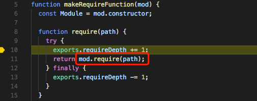
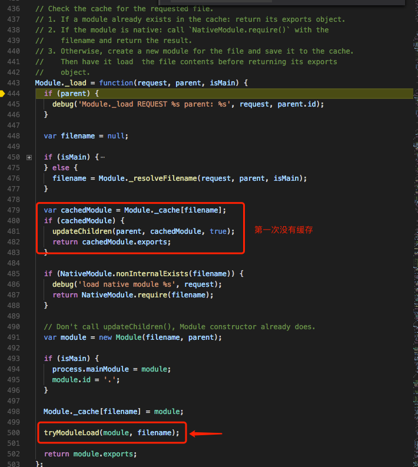
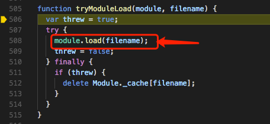
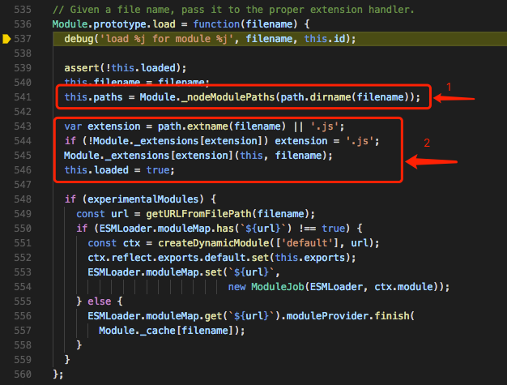
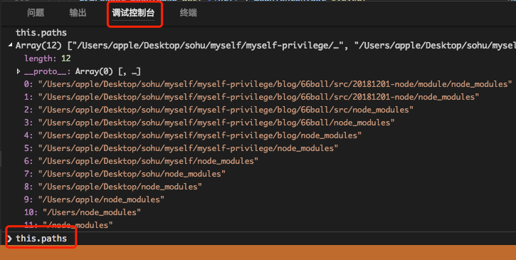
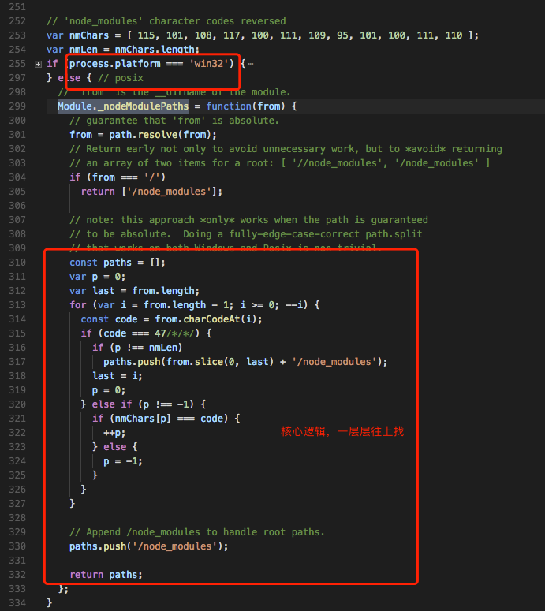
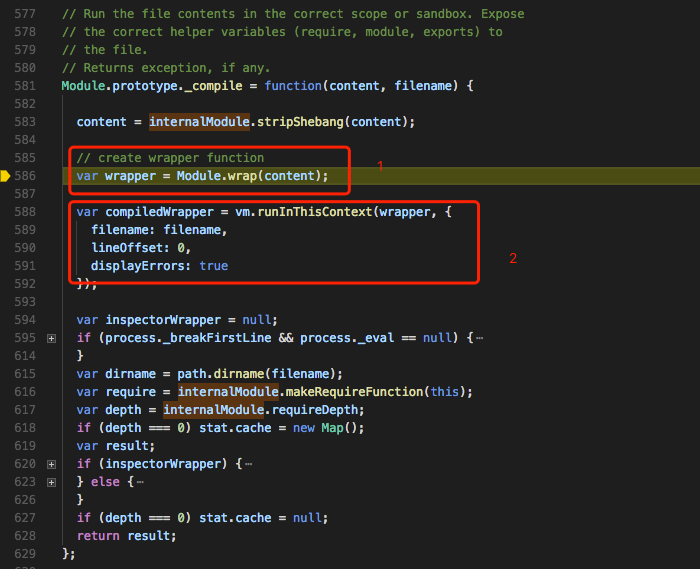
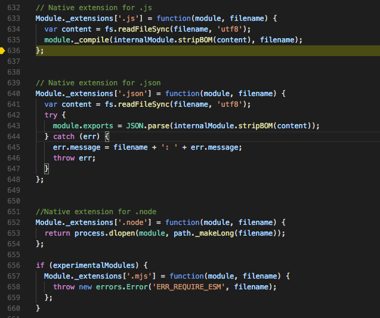
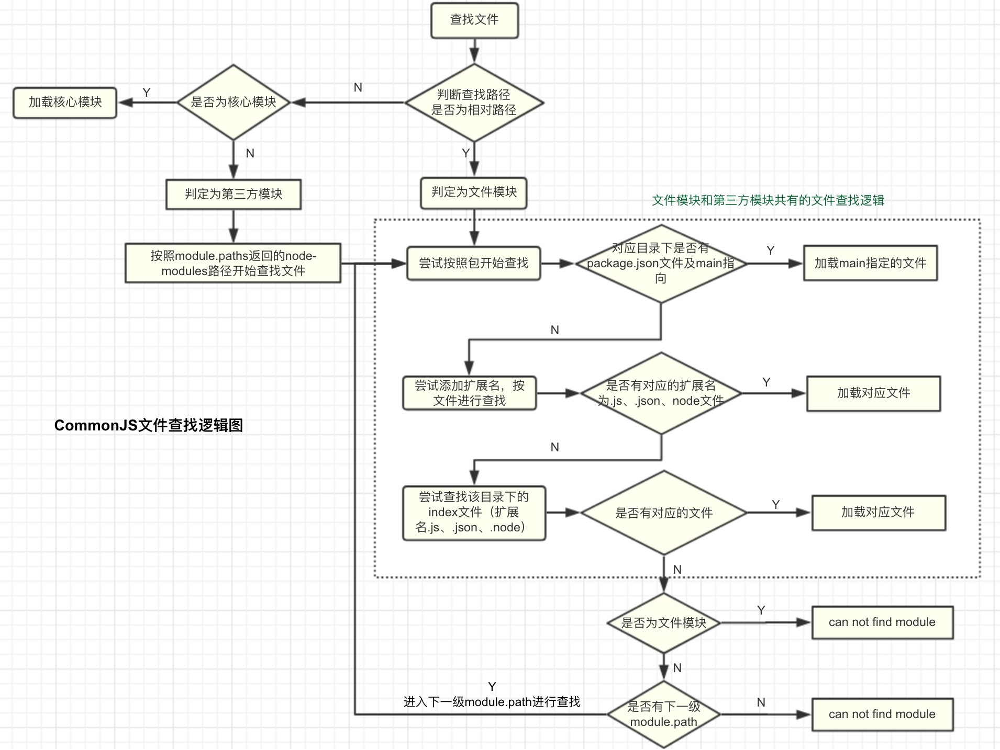

## 手摸手带你撸一个CommonJs规范

Node系列-上一节[事件循环详解](./eventLoop.md)

### 目录

- 为什么会有模块化
  - 防止代码重名 变量污染全局
  - 太长，使用不爽
- 怎么实现模块化的思路
  - 闭包
- 以前的废弃了 AMD、CMD
- 现代使用Node：CommonJs、es6：esModule
  - CommonJs：node主用
    - 如何自己撸一个
  - esModule
    - 待完善

### 为什么需要模块化

随着前端的发展，页面特效、交互都在前端层面实现，前端的代码逻辑复杂度增加。
写代码不可能一把唆，都写入一个文件当中，这样可读性不强也不利于后期的维护。
需要利用模块的思想将代码进行划分，使其职责单一且可替换。

并且需要防止变量污染全局，防止变量的重命名。

### 模块化发展历程

简单提一下模块化从概念引入到今天的一个发展历程。

#### 直接定义依赖（1999）

直接定义依赖和现在流行的`CommonJs`相似，不同点在于`CommonJs`中定义一个文件即一个模块，而它则可以再任何文件中定义模块，模块和文件不关联。`Dojo`的思想。

#### namespace模式（2002）

使用命名空间主要是为了解决变量命名冲突的问题。`YUI`的思想。

#### 闭包模式（2003）

引入闭包模式解决了变量污染的问题。

#### 注释定义依赖（2006） 

在文件头加上一些注释标记该文件的依赖，然后在编译时解析引入依赖。

#### 依赖注入（2009）

`Angular`中引入了其思想。

#### CommonJs（2009）

现代流行的模块化解决方案，从Node端再引入到前端。也是本文着重讲解的一个知识点。

#### AMD（2009）

`RequireJs`的思想，核心是依赖前置。

#### CMD（已废弃）

`SeaJs`的思想，核心是按需加载。不过玉伯现在没维护了，相当于已经废弃了。

#### UMD（2011）

兼容了`CommonJs`和`AMD`，核心思想是如果在`CommonJs`环境下，即存在`module.exports`，不存在`define`时将函数执行结果交给`module.exports`实现`CommonJs`；否则使用`AMD`环境的`define`。

#### Es6 Module（2015）

现代的模块化方案，`Node9+`支持，可以通过启动加上flag`--experimental-modules`使用。

在浏览器端可以通过`<script type="module" src="xxx"></script>`的方式使用。

### 如何实现一个CommonJs规范

本文的重点是解析`CommonJs`规范的核心思想。

以下涉及到的代码均在仓库中，感兴趣的可以[前往调试](./module)

#### 断点调试作为切入点

首先我们可以先通过断点调试`require(path/to/file)`方法作为切入点了解其中机制。

准备了两个文件`1.case.js`和`require.js`

1.case.js 文件内容
```js
let info = require('./1.require.js')
console.log(info)
```
require.js 文件内容
```js
module.exports = {
  name: 'careteen',
  age: '23'
}
```
1、点击`进入函数内调试`两次即可进入


2、进入到了`module.js`源文件



里面提供了一个`mod`为`Module`类的实例，并且提供一个`require`方法，进入方法内查看

3、首先做了一些路径的断言，然后返回`Module._load()`，将当前文件名传入，进入方法内查看


4、里面有缓存的功能，由于我们是第一次加载这个文件，没有缓存，所以直接跳过


`491`行new了一个`Module`实例，在`500`行传入`tryModuleLoad`方法，再进入此方法内查看

5、做了一层`try...catch`，实际调用实例上的`load`方法，再进入此方法内查看


6、先会判断是否加载过，防止重复加载。


`1`标志位上会对文件名处理，我们可以再`调试控制台`中输入`this.paths`查看最终的处理结果


实际上就是对查找做了一层层的判断，如果当前目录没有`node_modules`，去上一级目录查找，如此递归.具体实现如下图


`2`标志位会取到文件的扩展名根据类别做处理，可进入`Module._extensions()`方法内查看

7、使用`fs.readFileSync()`方法同步读取到文件内容


然后再调用实例的`_compile`方法，进入方法内查看

8、`1`标志位会将读取的内容调用静态方法`wrap`进行包裹



包裹方法如下图


包裹后的内容如下


从以上可看出相当于使用了闭包，匿名函数中传入在`module`实例上的一些属性`exports/require/module...`

以便在`require`的时候能读取到。

`2`标志位使用了`vm`内置模块沙箱式运行代码。

其功能相当于`eval('console.log(name)')`和`new Function('console.log(name)')`。

9、以上步骤就模块化的大致思路，跳出以上所有方法内部。

10、对于文件类型处理还需考虑另外两种情况，实现原理类似。



只不过`.json`文件读取后会被转成一个`JSON对象`。

### 实现一个简易的模块化

跟着上面的思路我们大致了解到了模块化的几个核心点

- 缓存，提高读取性能
- 处理文件的查找规则（下面将会给出详细查找规则）
  - 内置模块如何处理
  - 第三方模块如何处理
  - 文件模块如何处理
- 通过`fs.readFileSync()`读取文件内容
- 处理`.js/json/node`三种文件类型
  - `.js`通过内置模块`vm`使其沙箱式执行文件内容
  - `.json`读取后转为`JSON对象`
  - `.node`是一个二进制的`C++`文件，是可以直接运行的

下面针对以上各个核心点一一突破

#### 如何实现缓存

挂一个缓存对象即可

#### 处理文件的查找规则

一图胜千言




#### 处理三种文件类型

`.js`文件左一层包裹

`.json`读取后转为`JSON对象`

[简易实现代码见仓库](./module/require.js)

