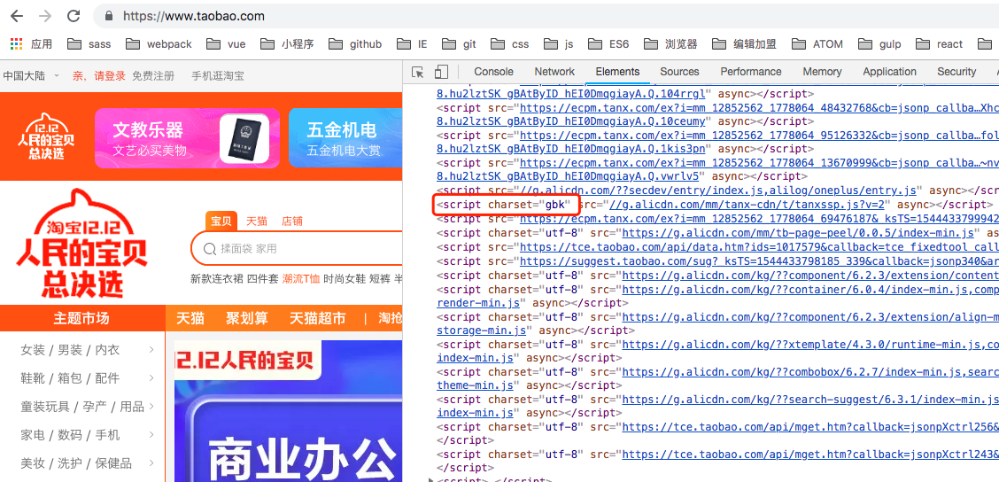

## fs常用API及树的遍历算法

### 目录

- fs是个什么鬼
- 读文件
- 写文件
- 拷贝文件（先读后写）
  - 编码问题1：场景（爬虫）下读取的是GBK
  - 编码问题2：GBK->UTF8 会出现一个BOM头
  - 拷贝一份特别大超出当前内存的文件，此时应该用流解决
- 递归创建目录
  - 同步创建
  - 异步创建
- 递归删除目录
  - 同步 深度优先
  - 异步 先序 串行 深度优先 （KOA源码中对应方法用此方式实现）
  - 异步 先序 并行 深度优先
  - 异步 先序 并行 深度优先 （promise版）
  - 异步 先序 并行 深度优先 （async版）
  - 同步 广度优先
  - 应用
    - webpack打包时删掉之前的dist

### fs是个什么鬼

`fs`模块主要是和文件系统进行交互。实现了所有有关文件及目录的创建写入删除等等操作。

`fs`模块所有的方法都有同步、异步（后缀为async）两种实现方式。

下面将给出`fs`在工作中常使用的几个`API`，并且分析源码实现。

### 读文件

这里的读文件是整体读取文件。

首先需要准备依赖和帮助函数，并且创建`1.txt`文件。

```js
// 下面例子默认已导入了依赖
const fs = require('fs')
const path = require('path')

function resolvePath (p) {
  return path.resolve(__dirname, p)
}
```

先来看看异步读取文件
```js
fs.readFile(resolvePath('./1.txt'), {
  encoding: 'utf8', 
  flag: 'r'
}, (err, data) => {
  console.log(`async read : ${data}`)
})
```
再来看看同步读取文件，工作中也更推荐使用异步的方式，因为这样不会阻塞程序。
```js
let rRet = fs.readFileSync(resolvePath('./1.txt'), {
  encoding: 'utf8', 
  flag: 'r'
})
console.log(`sync read : ${rRet}`)
```
可以看到第二参数是一个对象，默认提供`utf8`的编码格式和`r(read)`读取的操作符。第二个参数可以省略不传。

说到操作符，有以下几种

- r: read 读取
- w: write 写入
- a: append 追加写入


### 写文件

先来看看异步写入文件
```js
fs.writeFile(resolvePath('./1.txt'), '我说今晚月光这么美，你说是的。', {
  encoding: 'utf8', 
  flag: 'w',
  mode: 0o666
}, (err, data) => {
  console.log(`async write success`)
})
```
再来看看同步写入文件
```js
fs.writeFileSync(resolvePath('./1.txt'), '我说今晚月光这么美，你说是的。', {
  encoding: 'utf8', 
  flag: 'w',
  mode: 0o666  
})
```
可以看到第三参数是一个对象，默认提供`utf8`的编码格式和`w(write)`写入的操作符，默认权限为`0o666`。第三个参数可以省略不传。

说到权限，权限`0o666`的十进制表示为`777`，为最高权限。

一般的我们会使用`chmod -R 777`这样的形式为一个文件设置权限。

其中各个权限的数值如下

- 1 执行
- 2 读取
- 4 写入

`777`的`第一个7`表示当前用户的权限，`第二个7`表示当前用户所在组的权限，`第三个7`表示非当前用户所在组的权限。

所以可以有多种组合权限

- 1: 只有执行的权限 1
- 2: 只有读取的权限 2
- 3: 拥有执行和读取的权限 1+2
- 4: 只有写入的权限 4
- 5: 拥有执行和写入的权限 1+4
- 6: 拥有读取和写入的权限 2+4
- 7: 最高权限 1+2+4

### 拷贝文件

异步的写法
```js
fs.copyFile(resolvePath('./1.txt'), resolvePath('./2.txt'), (err, data) => {
  console.log(`async copy success`)
})
```

那我们来思考下拷贝的实现原理呢？

我们第一直觉会想到使用上面的API先读取后写入组合来实现拷贝文件。

先准备好依赖和辅助函数

```js
const fs = require('fs')
const path = require('path')
const { promisify } = require('util')

function resolvePath (p) {
  return path.resolve(__dirname, p)
}

let read = promisify(fs.readFile)
let write = promisify(fs.writeFile)
```

实现
```js
async function copyFile (source, target) {
  let chunk = await read(resolvePath(source))
  await write(resolvePath(target), chunk)
}

copyFile('./1.txt', './2.txt')
```
以上代码看似实现了拷贝功能，但是在某些情况下，还是存在一定问题。

#### 编码问题1：爬虫爬取的网页是GBK

使用爬虫爬取别人页面时，别人的页面可能是非`UTF8`编码的，比如前往[淘宝首页](https://www.taobao.com/)打开控制台，还能发现一些脚本是`GBK`编码格式的。



我们都知道`NodeJs`中写入文件只支持`utf8`格式。这个时候需要对编码做转换。

使用[iconv-lite](https://github.com/ashtuchkin/iconv-lite)可以对编码进行转换。

```js
// ...
let iconvLite = require('iconv-lite')

async function copyFilePo (source, target) {
  let chunk = await read(resolvePath(source))
  // 编码转换
  chunk = iconvLite.decode(chunk, 'gbk').toString()
  await write(resolvePath(target), chunk)
}
copyFilePo('./1.txt', './2.txt')
```

### 编码问题2：文件从GBK转为UTF8会出现BOM头问题

在`windows`环境下，新建一个文件先保存文件为`GBK`格式，然后再保存为`UTF8`格式，这个时候如果还使用上面的方法会发现在头部多了几个问号。

打出`buffer`可以看到多了一串`ef bb bf`，也被称作为`BOM`头。这在[分析commonJs规范原理](../20181201-node/module.md)时，源代码中也有这个处理，感兴趣的可以打断点调试查看。


所以需做如下处理

```js
function stripBOM (content) {
  if (Buffer.isBuffer(content)) {
    if (content[0] === 0xef && content[1] === 0xbb && content[2] === 0xbf) {
      return content.slice(3)
    }
  }
  if (content.charCodeAt(0) === 0xFEFF) {
    return content.slice(1)
  }
  return content
}

async function copyFilePt (source, target) {
  let chunk = await read(resolvePath(source))
  await write(resolvePath(target), chunk)
}
copyFilePt('./1.txt', './2.txt')
```

#### 问题3：拷贝一份超出当前内存特别大的文件

如上，我们提到过，`readFile`方法会读取整体文件，当拷贝一份超出当前内存特别大的文件时，电脑就GG呜呜呜的响了。

除了上面提到的两个问题以外，这个问题才是最严重的，所以我们不应该使用`readFile/writeFile`实现拷贝功能，应该使用[流]()一文中提到的流（一点一点读一点一点写）的方式来进行拷贝。

### 递归创建目录

下面涉及到的代码均已放在[仓库](./fs/3.mkdir.js)，需要的自取。

先看下面代码
```js
const fs = require('fs')
const path = require('path')

function resolvePath (p) {
  return path.resolve(__dirname, p)
}

fs.mkdir(resolvePath('./3.mkdir/a/b'), {
  recursive: true
}, (err) => {
  if (err) throw err
  console.log(`async mkdir suceess: `)
})
```
`mkdir`第二个参数是一个对象，其中`recursive`表示为递归创建，但是要求**父目录必须存在**，假若`3.mkdir/a`不存在，此时上面会抛出异常。

接下来实现**父目录不存在时也递归创建**

#### 同步方式实现

首先思考，如果要创建一个多级目录，我们可以先判断这个目录第一级是否存在，不存在则创建，存在则创建下一级目录，如此递归下去。是否存在可以使用`fs.access()`方法。

```js
const SEP = '/' // 分隔符
function mkdirRSync (p) {
  let arr = p.split(SEP)
  for (let i = 0; i < arr.length; i++) {
    let currentDir = arr.slice(0, i + 1).join(SEP)
    try {
      fs.accessSync(resolvePath(currentDir))
    } catch (error) {
      fs.mkdirSync(resolvePath(currentDir))
    }    
  }
}
mkdirRSync('./3.mkdir/a/b')
```

#### 异步方式实现

异步比同步稍微复杂一点，我们需要保证一级二级三级等目录是串行创建，如果一级不存在去创建二级是会抛错的。所以需要一个迭代函数，这种思路就是[异步发展流程]()中的generator使用的`co`库的思想。

```js
function mkdirR (p, cb) {
  let arr = p.split(SEP)
  // 需要一个迭代函数去创建计数
  const next = index => {
    if (index === arr.length) return cb && cb()
    let currentDir = arr.slice(0, ++index).join(SEP)
    fs.access(resolvePath(currentDir), err => {
      if (err) {
        fs.mkdir(resolvePath(currentDir), _ => {
          next(index)
        })
      } else {
        next(index)
      }
    })  
  }
  next(0)
}
mkdirR('./3.mkdir/a/b', _ => {
  console.log('async mkdirR success')
})
```

### 递归删除目录

我们先使用原生提供的`fs.rmdir(path)`测试一下

```js
const fs = require('fs')
const path = require('path')

function resolvePath (p) {
  return path.resolve(__dirname, p)
}

fs.rmdir(resolvePath('./4.rmdir'), err => {
  if (err) throw err
  console.log(`async rmdir success`)
})
```
会发现抛错，因为`fs.rmdir(path)`只能删除空目录，这显然不是我们期望的。

删除多级目录在工作中是非常常见的，比如`webpack打包`时，会先删除`dist`目录，然后再生成一份。所以我们有必要去实现此功能。

先来捋捋思路，删除多层级目录，我们应该先删除`子文件子空目录`，然后再删除自己，以此递归到需要`删除的根目录`为止。

那就涉及到几个API

- `fs.readdir(path)`：读取`path`目录的儿子，读取不到孙子，只有一层。
- `fs.stat(path)`：判断一个文件是否存在，存在会返回一个状态对象`statObj`
  - `statObj.isFile/isDirectory()`：对状态对象判断是否为文件/目录
- `fs.unlink(file)`：删除一个文件

#### 同步深度优先先序删除多级目录

因为同步的代码相比于异步更好写和理解，所以先来看看同步的实现方式。

根据上面的思路，我们应该有个比较明确的实现思路。

利用上面创建多级目录的代码，我们先创建一个多级目录，以供后续的删除做基础。
```js
const { promisify } = require('util')

const { mkdirR } = require('./3.mkdir')

// 准备工作 创建多级目录
//         4.rmdir -> a -> c
//         4.rmdir -> b -> d
const mkdirRP = promisify(mkdirR)
async function mkdirMyDir () {
  await mkdirRP('./4.rmdir/a/c')
  await mkdirRP('./4.rmdir/b/d')
}
mkdirMyDir().then(_ => {
  console.log('async mkdirR success')
})
```

然后使用递归的方式实现
```js
function rmdirRSync (p) {
  // 拿取到当前的文件状态
  let statObj = fs.statSync(resolvePath(p))
  if (statObj.isFile()) { // 文件直接删除
    fs.unlinkSync(resolvePath(p))
  } else { // 目录 取儿子然后进行迭代
    let dirs = fs.readdirSync(resolvePath(p))
    dirs.forEach(dir => { // 迭代儿子
      rmdirRSync(joinPath(p, dir))
    })
    // 此时自己已经是空目录了 删除自己
    fs.rmdirSync(resolvePath(p))
  }

}
rmdirRSync('./4.rmdir')
```
如上思路已经非常清晰。

#### 异步深度优先串行先序删除多级目录

接着对上面的同步代码改造成异步的方式。


- 同步 深度优先
- 异步 先序 串行 深度优先 （KOA源码中对应方法用此方式实现）
- 异步 先序 并行 深度优先
- 异步 先序 并行 深度优先 （promise版）
- 异步 先序 并行 深度优先 （async版）
- 同步 广度优先


