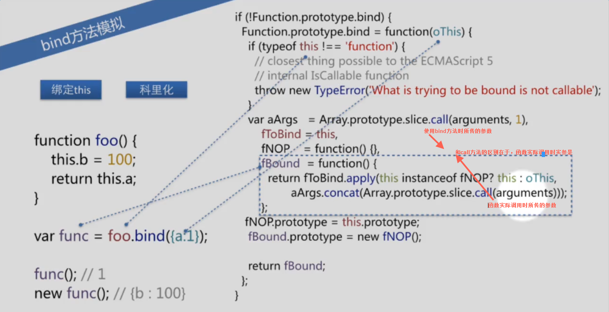

# JS知识

- todo：使用doctoc生成目录

## JavaScript对象是面向对象还是基于对象的？

- JavaScript中对象独有的特色是：对象具有高度的动态性，这是因为JavaScript赋予了使用者在运行时为对象添改状态和行为的能力。这根绝大多数基于类的、静态的对象设计完全不同。
- 面向对象的特征：封装、继承、多态。
- **标准中：JavaScript是面向对象的。**

## 我们真的需要模拟类吗？

- ES6之前可以用function和prototype去模拟
- ES6之后我们可以利用class、extend正大光明去使用类了！
- 下面使用构造器模拟类的两种方式
  ```js
  // function
  function c1(){
    this.p1 = 1;
    this.p2 = function(){
      console.log(this.p1);
    }
  } 
  var o1 = new c1;
  o1.p2();
  
  // prototype
  function c2(){
  }
  c2.prototype.p1 = 1;
  c2.prototype.p2 = function(){
    console.log(this.p1);
  }
  var o2 = new c2;
  o2.p2();
  ```

## 你知道全部的对象分类吗？

-

## 原始类型有哪几种？null是对象吗？基本数据类型和引用类型在存储上的差别？

- 原始类型有`undefined、null、boolean、number、string、symbol`六种，ES6新增了`symbol`类型。
- `null`是一个关键字并非对象，它的语义表示空值。
- 基本数据类型和引用类型在`存储`上的区别是：
  - 基本数据类型存储在`栈`中，因为这些基本类型占据的空间是固定的，所以将其存入较小的内存区域栈中，便于快速查询变量的值。比如`var a = 10; var b = a; b = 20; console.log(a)`，此时的打印结果是`10`，因为`var b = a`只是将`a`的值复制了一份，去更改`b`的值并不会影响`a`。
  - 引用数据类型存储在`堆`中，也就是说，在栈中存储在变量处的值是一个指向堆内存的一个引用地址。比如`var obj1 = new Object(); var obj2 = obj1; obj2.name = 'careteen'; console.log(obj1.name)`，此时的打印结果是`careteen`，因为`var obj2 = obj1`将`obj1`的引用地址复制了一份，当更改其中一个变量的值时，都是操作的同一块推内存空间，另一个也会更新。

## 说一下JS中类型转换的规则？

- 存在的意义：由于JavaScript是一门弱类型语言，类型转换是非常频繁的。
- 转换规则
  - 先上一张图
   
  - 基本类型之间转换
    - 将`null`,`undefined`,`true/false`,`number`转换为`boolean,number,string`规则较为简单，如上图所示。
  - StringToNumber
    - `string`转换为`number`会稍微复杂一点。转为`number`类型提供了`parseInt/parseFloat`两个函数，也可以用`Number`基本对象类型进行转换。
    - `parseInt`函数提供两个参数，第二个参数是第一个参数的进制数，如果不传会存在一些兼容性问题，在不同浏览器表现不一致，所以在工作中使用到了此函数，都约定好了传第二个参数。
    - 还是强烈建议使用`Number`进行转换。避免可能存在的问题发生。
  - NumberToString
    - 不那么重要吧
  - 装箱转换
    - 也就是将基本类型转为对象类型。其实每一种基本类型在对象中都有对应的类（Number...）。
  - 拆箱转换
    - 也就是将对象类型转换为基本类型。其中存在一些隐式规则。会尝试调用对象的`valueOf`和`toString`方法进行转换。
      - 比如所求表达式的结果看起来像一个`Number`类型，那么会先调用`valueOf`再调用`toString`去尝试转换
      - 比如所求表达式的结果看起来像一个`String`类型，那么会先调用`toString`再调用`valueOf`去尝试转换

- 参考[winter重学前端](https://time.geekbang.org/column/article/78884?utm_term=zeusRWKG3&utm_source=app&utm_medium=zhuanti)

## == 和 === 区别，什么情况用 == ？

- 三个等号为严格判断，即前提是两个变量若为同一种类型才会进行值是否相等的判断，否则直接返回false。
- 两个等号则不严格，若两个变量类型不一致，则会尝试将其转为同一类型再进行值得判断。转换规则挺多，记不住，所以开发过程都不会使用两个等号，避免一些不必要的bug。
- 两个等号的应用场景：当不确定两个变量类型是否相同时，但仍需比较两个变量，则可以使用。

- `==`操作符的一些规则

  解析`[] == ![] // => true`的转换过程：
  ```js
  // [] 转成 true，然后取反变成 false
  [] == false
  // 根据第 8 条得出
  [] == ToNumber(false)
  [] == 0
  // 根据第 10 条得出
  ToPrimitive([]) == 0
  // [].toString() -> ''
  '' == 0
  // 根据第 6 条得出
  0 == 0 // -> true
  ```

## 为什么 0.1+0.2 != 0.3 ？

- 因为计算机存储数字的方式是采用`IEEE-754`规定的双精度浮点数规则。此规则规定一个数用`64`位存储，第0位到第51位为尾数部分，第52位到第62位为指数部分，第63位为符号位。
- 十进制整数转为二级制是通过除二取余的方式，十进制小数转为二进制是通过乘二取整的方式。
- 十进制小数转为二进制过程一般会无限循环，此时因为存储尾数有限为丢掉一部分。`所以此过程可能会丢失精度`。
- 浮点数的运算是十进制小数转为二进制后进行`对阶运算`，此过程也可能丢失精度。
- 由以上两点可能失去精度，故`0.1+0.2!=0.3`
- 解决方法
  - 可以将其转为整数再进行计算。但是对于大数来说不太友好
  - `Number`提供一个最小精度`EPSILON`可实现判断
    ```js
    // 如果两个数的差值的绝对值小于这个精度，则认为这两个数相等。
    Math.abs(0.1 + 0.2 - 0.3) <= Number.EPSILON
    ```
- 参考自[0.1 + 0.2不等于0.3？为什么JavaScript有这种“骚”操作？](https://www.sohu.com/a/254865340_796914)

## 深拷贝和浅拷贝的区别？如何实现？

## new 的原理是什么？通过 new 的方式创建的对象和通过字面量创建有什么区别？

- 使用new调用函数，或者说发生构造函数调用时，会自动执行下面的操作
  - 创建（或者说构造）一个全新的对象
  - 这个新对象会被执行`[[原型]]`连接
  - 这个新对象会绑定到函数（构造器）调用的this
  - 如果函数（构造器）没有返回其他对象，那么new表达式中的函数（构造器）调用会自动返回这个新对象

- `new`和`对象字面量`的区别
  - 唯一区别就是：对象字面量可以一次指定多个键值，而new需要一个一个指定

## 如何正确判断 this ？箭头函数的 this 是什么？

- **任何足够先进的技术都和魔法无异。**

- this的绑定和函数声明的位置没有任何关系，只取决于函数的调用方式
- 绑定规则
  - 默认绑定 - window（not strict）/ undefined（strict）
  - 隐式绑定
    - 作为对象的属性 - 对象调用时this会指向对象
    - 作为对象的属性 - 调用时去引用对象的属性此时this会指向window
    - 作为函数参数传入 - 正常执行时this会指向window，类似于语言内置的setTimout函数
  - 显示绑定
    - 硬绑定
    - API调用的上下文
  - new绑定
     - 使用new调用函数，或者说发生构造函数调用时，会自动执行下面的操作
      - 创建（或者说构造）一个全新的对象
      - 这个新对象会被执行`[[原型]]`连接
      - 这个新对象会绑定到函数调用的this
      - 如果函数没有返回其他对象，那么new表达式中的函数调用会自动返回这个新对象
- 绑定优先级
  - 在判断`this`时会按照上面的绑定规则的优先级进行查找：`new > 显示 > 隐式 > 默认`
  - 1. 函数是否在`new`中调用（`new绑定`）？如果是的话`this`绑定的是新创建的对象
  - 2. 函数是或否通过`call、apply`（显示绑定）还活着硬绑定调用？如果是的话，`this`绑定的是指定的对象
  - 3. 函数是否在某个上下文对象中调用（隐式绑定）？如果是的话，`this`绑定的是哪个上下文对象。
  - 4. 如果都不是的话，使用默认绑定。如果在严格模式下，就绑定到`undefined`，否则绑定到全局对象。
  - 5. 规则总有例外，这个判断顺序也一样。
    - 显示绑定时使用`null`，此时this会指向`window`，此情况不安全，因为可能会修改全局window的属性；更安全一点是使用`var ø = Object.create(null)`去代替`null`，因为他没有原型指向，更安全。
    - 可能会出现类似于`(p.foo = o.foo)()`这样的间接引用代码，此时走的其实是默认绑定。
    - 软绑定
      - todo

- `this词法`即箭头函数
  - 箭头函数不会使用上面呢的四条标准的绑定规则，而是根据当前你的词法作用域来决定this，具体来说，箭头函数会继承外层函数调用的this绑定（无论this绑定到什么）。这个不使用箭头函数时`self = this`方式机制一样。
  - 通俗点理解：箭头函数的this是在声明时的上层词法作用域，已经确定了，并非运行时确定。

## 什么是闭包？

- 几种表述
  - 
  - 在定时器、事件监听器、ajax请求、跨窗口通信、webworkers胡宏哲任何其他的异步（或者同步）任务中，只要使用了回调函数，实际上就是在使用闭包。

## 如何理解原型？如何理解原型链？

- 如果要访问对象中不存在的一个属性，`[[GET]]`操作就会查找对象内部`[[Prototype]]`关联的对象。这个关联关系实际上定义了一条（原型链），在查找属性时会对它遍历。
- 关联两个对象最常用的方法就是用`new`关键字进行函数调用，会创建一个关联其他对象的新对象。
  - 下面模拟下ES5中关联对象的方法`Object.create()`
  ```js
  Object.create = function (o) {
    function F () {}
    F.prototype = o
    return new F()
  }
  ```
  - 其中特别的一点是`Object.create(null)`会创建一个空对象，没有原型链，无法进行委托。所以没法用`instanceof`去判断。
- ES6中`Object.getProtoOf()`、`Object.setProtoOf()`可以获取和设置一个对象的原型指向。

## 什么是变量提升？

- 作用域
  - 前置：编译
    - 词法分析
    - 语法分析
    - 生成代码
  - 前置：扮演的角色
    - 引擎
    - 编译器
    - 作用域
  - 词法作用域
    - 一些欺骗的词法（不推荐使用，可能造成性能问题）
      - eval
      - with
      - new Function 安全性较上面两种高一点
  - 函数作用域和块作用域
    - 块作用域
      - ES3提供的`try...catch`的`catch`分支
      - ES6提供的`let/const`关键字
      - with（但不推荐使用）

- 变量提升
  - 简言之：变量和函数的声明会提前到当前作用域的最上面。
  - 声明函数的函数体会提前，但是函数表达式的函数体并不会提前。
  - 函数比变量优先提升

## typeof 和 instanceof 的区别？实现一个 instanceof ？

- `typeof`对于原始类型来说，除了`null`都可以显示正确的类型。`typeof`对于对象来说，除了函数都后悔显示`object`，所以他并不能准确判断变量是什么类型的。
- `instanceof`内部是通过原型链来判断的，能`较为准确`判断一个对象的正确类型，之所以说是较为准确，是因为提供了方法可以去更改`instanceof`的行为。而且对于原始类型，不能通过`instanceof`判断。
- 实现自己的`instanceof`
  - todo

## call、apply及bind函数内部实现是怎么样的？

- call
  - todo
- apply
   - todo
- bind



## 说一下你对JavaScript执行上下文栈和作用域的理解？

- 执行栈上下文栈
  - todo
- 作用域
  - 作用域是一套规则，用于确定在何处以及如何查找变量（标识符）。
  - 如果查找的目的是对变量进行赋值，那么会使用`LHS`查询，如果是获取变量的值，会使用`RHS`

## 为什么会出现setTimeout倒计时误差？

- todo 题目待完善。